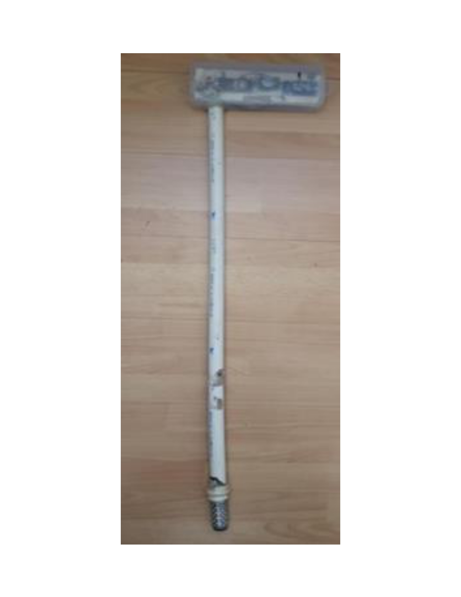

#IoT-DatePalm-Irrigation-Mexicali
<p align="center">
  
</p>
# Arquitectura basada en Internet de las Cosas (IoT) para la optimización del agua en el cultivo de palma datilera
**Repositorio de reproducibilidad de tesis  **
**Autora:** Verónica Quintero Rosas
**Año:** 2026

---

#  Descripción

Este repositorio contiene el firmware, los procedimientos de calibración, el conjunto de datos experimental, la documentación técnica y los archivos asociados a la investigación doctoral titulada:

> **Internet de las Cosas (IoT) en la optimización del agua en la agroindustria datilera: Caso de estudio Valle de Mexicali, Baja California.**

La arquitectura propuesta integra tecnologías IoT de bajo costo para el monitoreo continuo de la humedad del suelo en condiciones reales de operación mediante el uso de:

- ESP32
- Sensor Watermark 200SS
- Comunicación inalámbrica XBee IEEE 802.15.4
- AWS IoT Core
- MQTT
- AWS Lambda
- Amazon DynamoDB

---

# Objetivos de la investigación

- Monitorear continuamente la humedad del suelo.
- Apoyar la toma de decisiones para el riego de precisión.
- Comparar la cadena de medición propuesta con una cadena de medición comercial de referencia.
- Evaluar el desempeño mediante métricas estadísticas.
- Proporcionar una arquitectura IoT de bajo costo y fácilmente reproducible para aplicaciones de agricultura de precisión.

---

# Validación experimental

| Métrica | Resultado |
|---------|----------:|
| Mediciones pareadas válidas | 2232 |
| RMSE | 2.30 cb |
| NRMSE | 5.82 % |
| Validación | Condiciones reales de campo |
| Comparación del consumo de agua | Método tradicional vs. protocolo de riego asistido por el sistema IoT |

---

# Hardware utilizado

- ESP32 DevKit
- Sensor Watermark 200SS
- Sensor DHT11
- Módulos XBee IEEE 802.15.4
- Amplificador operacional MCP602
- Fuente de alimentación

---

#  Software
- Librerías ESP32
- MQTT
- AWS IoT Core
- AWS Lambda
- Amazon DynamoDB

---

#  Estructura del repositorio

```
Firmware/
AWS/
Calibration/
Dataset/
Documentation/
Results/
```

---

# Reproducibilidad

Este repositorio fue organizado para facilitar la reproducibilidad de la investigación.

Incluye:

- Firmware del sistema
- Procedimientos de calibración
- Conjunto de datos experimental
- Documentación técnica
- Resultados experimentales
- Configuración de la infraestructura en la nube

Por razones de seguridad, se eliminaron certificados digitales, claves privadas, identificadores de cuentas AWS, endpoints y demás información sensible.

---

# Cómo citar este trabajo

Si utiliza este repositorio en trabajos académicos o de investigación, por favor cite la tesis  asociada.

**DOI:** Se incorporará una vez publicado el repositorio en Zenodo......

---

#  Licencia

Este proyecto se distribuye bajo la licencia MIT.
